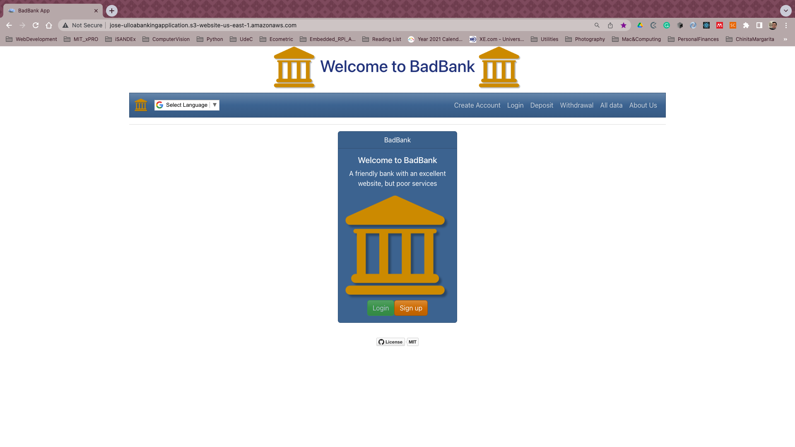

<h1 align="center">
  Fullstack Bank Application
  <br>
</h1>
<h4 align="center">Tiered (not so) Bad Bank Application</h4>

<p align="center">
<a href="https://validator.nu/?doc=https://jlulloaa.github.io/fullstack-bankapp">
<!--  -->
</a>
  
  
  
  <a href="https://github.com/jlulloaa/fullstack-bankapp/blob/master/LICENSE.md" target="_blank"> </a>

</p>

<p align="center">
  <a href="#description">Description</a> •
  <!-- <a href="#file-manifest">Files</a> • -->
  <a href="#how-to-run">How To Run</a> •
  <a href="#roadmap-of-future-improvements">What's next?</a> •
  <a href="#contributing">Contributing</a> •
  <a href="#credits">Credits</a> •
  <a href="#license-information">License</a>
</p>

<a href="http://jose-ulloabankingapplication.s3-website-us-east-1.amazonaws.com/" target="_blank">  </a>

# Description
[BadBank](https://jose-ulloafullstackbankingapplication.onrender.com/) is a web application developed with the MERN stack. A [React-based](https://reactjs.org) frontend allows users to interact with the application. An [Express]() web server over [nodejs]() runtime environment enables interaction of the frontend with a cloud-based [mongodb] database. By deploying the [GitHub repository](https://github.com/jlulloaa/fullstack-bankapp) into [render.com](https://render.com/), a continuous integration and deployment (CI/CD)approach is used to ensure users access the latest version of the application.

# How To Run 
*Installation Guidelines: Clear instructions on how to get your project up and running (e.g., git clone, git pull, npm init).*
* Screenshots: Screenshots or a GIF of your project in action.

# Technology and Features
* Technology used: Your technology stack, listed out. 
* Features: Your project’s features, and any future features you would like to include.
* Folder tree:
<!-- How to make this folder tree?  -->
```
├── LICENSE.md
├── README.md
├── backend
│   ├── authenticate
│   │   └── authenticate.js
│   ├── config
│   │   ├── config.env
│   │   └── fir-env.json
│   ├── controllers
│   │   └── dal.js
│   ├── db
│   │   └── mongodBConn.js
│   ├── models
│   │   └── schemas.js
│   ├── package-lock.json
│   ├── package.json
│   ├── routes
│   │   └── routes.js
│   └── server.js
├── frontend
│   ├── package-lock.json
│   ├── package.json
│   ├── public
│   │   ├── 404.png
│   │   ├── bank_icon.png
│   │   ├── bank_logo.png
│   │   ├── favicon.ico
│   │   ├── index.html
│   │   ├── logo192.png
│   │   ├── logo512.png
│   │   ├── manifest.json
│   │   └── robots.txt
│   └── src
│       ├── App.js
│       ├── App.test.js
│       ├── Components
│       │   ├── about.js
│       │   ├── accountsummary.js
│       │   ├── alldata.js
│       │   ├── card.js
│       │   ├── context.js
│       │   ├── createaccount.js
│       │   ├── deposit.js
│       │   ├── footer.js
│       │   ├── home.js
│       │   ├── login.js
│       │   ├── logout.js
│       │   ├── navbar.js
│       │   ├── transfer.js
│       │   ├── withdraw.js
│       │   └── workinprogress.js
│       ├── index.js
│       ├── reportWebVitals.js
│       ├── setupTests.js
│       ├── styles
│       │   ├── App.css
│       │   └── index.css
│       └── utils
│           ├── fir-login.js
│           ├── middleware.js
│           └── tools.js
```

# Roadmap of future improvements
...

# Contributing
Pull requests are welcome, and I'll be happy to chat about any improvement or extension that could be donde to this app.

# Credits
This software uses the following third party tools:
* [Create React App](https://github.com/facebook/create-react-app) (see <a href="#getting-started-with-create-react-app">details below</a>)
# License information
This project is licensed under the terms of <a href="https://github.com/jlulloaa/fullstack-bankapp/blob/main/LICENSE" target="_blank"> MIT license </a>

---

# Additional Information
# Getting Started with Create React App

This project was bootstrapped with [Create React App](https://github.com/facebook/create-react-app).

## Available Scripts

In the project directory, you can run:

### `npm start`

Runs the app in the development mode.\
Open [http://localhost:3000](http://localhost:3000) to view it in your browser.

The page will reload when you make changes.\
You may also see any lint errors in the console.

### `npm test`

Launches the test runner in the interactive watch mode.\
See the section about [running tests](https://facebook.github.io/create-react-app/docs/running-tests) for more information.

### `npm run build`

Builds the app for production to the `build` folder.\
It correctly bundles React in production mode and optimizes the build for the best performance.

The build is minified and the filenames include the hashes.\
Your app is ready to be deployed!

See the section about [deployment](https://facebook.github.io/create-react-app/docs/deployment) for more information.

### `npm run eject`

**Note: this is a one-way operation. Once you `eject`, you can't go back!**

If you aren't satisfied with the build tool and configuration choices, you can `eject` at any time. This command will remove the single build dependency from your project.

Instead, it will copy all the configuration files and the transitive dependencies (webpack, Babel, ESLint, etc) right into your project so you have full control over them. All of the commands except `eject` will still work, but they will point to the copied scripts so you can tweak them. At this point you're on your own.

You don't have to ever use `eject`. The curated feature set is suitable for small and middle deployments, and you shouldn't feel obligated to use this feature. However we understand that this tool wouldn't be useful if you couldn't customize it when you are ready for it.

## Learn More

You can learn more in the [Create React App documentation](https://facebook.github.io/create-react-app/docs/getting-started).

To learn React, check out the [React documentation](https://reactjs.org/).

### Code Splitting

This section has moved here: [https://facebook.github.io/create-react-app/docs/code-splitting](https://facebook.github.io/create-react-app/docs/code-splitting)

### Analyzing the Bundle Size

This section has moved here: [https://facebook.github.io/create-react-app/docs/analyzing-the-bundle-size](https://facebook.github.io/create-react-app/docs/analyzing-the-bundle-size)

### Making a Progressive Web App

This section has moved here: [https://facebook.github.io/create-react-app/docs/making-a-progressive-web-app](https://facebook.github.io/create-react-app/docs/making-a-progressive-web-app)

### Advanced Configuration

This section has moved here: [https://facebook.github.io/create-react-app/docs/advanced-configuration](https://facebook.github.io/create-react-app/docs/advanced-configuration)

### Deployment

This section has moved here: [https://facebook.github.io/create-react-app/docs/deployment](https://facebook.github.io/create-react-app/docs/deployment)

### `npm run build` fails to minify

This section has moved here: [https://facebook.github.io/create-react-app/docs/troubleshooting#npm-run-build-fails-to-minify](https://facebook.github.io/create-react-app/docs/troubleshooting#npm-run-build-fails-to-minify)
